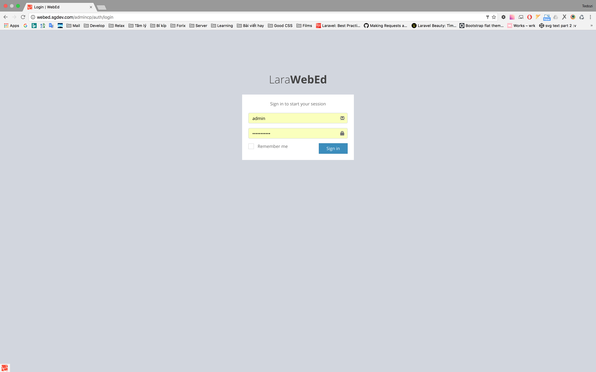
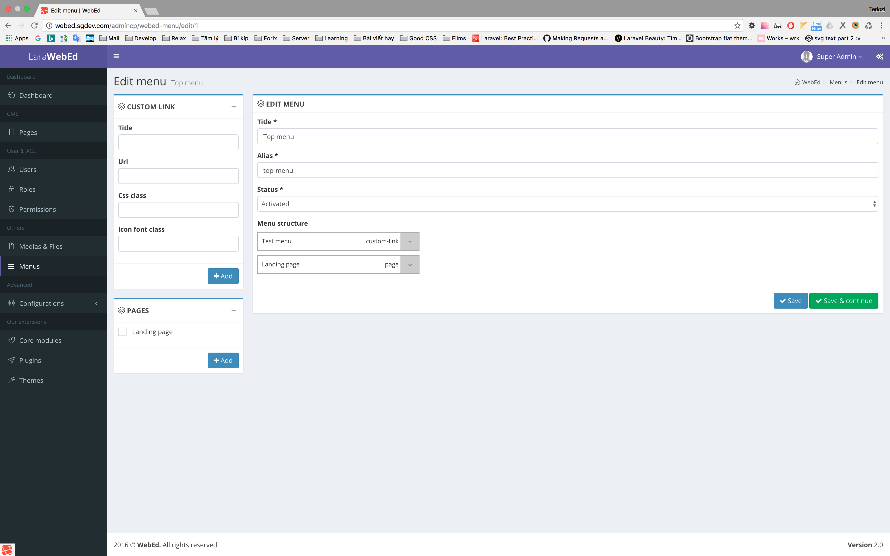
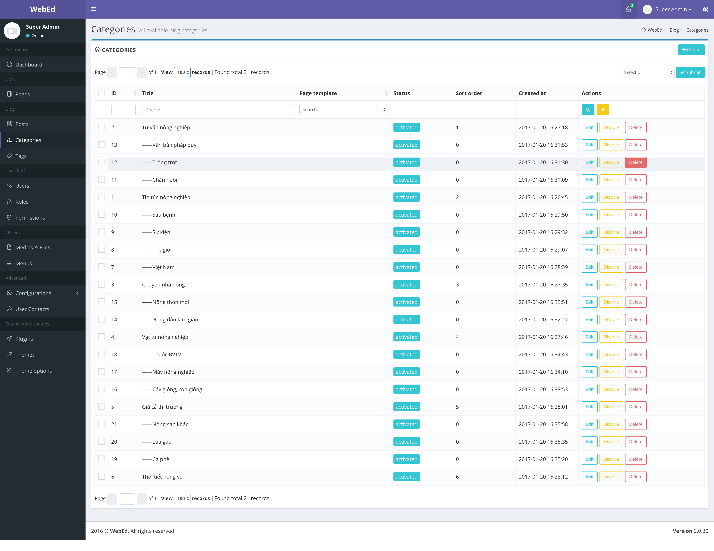
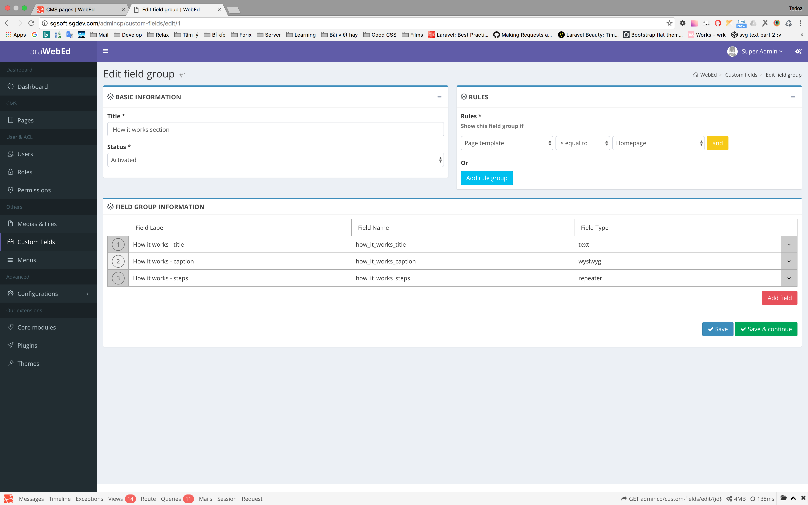
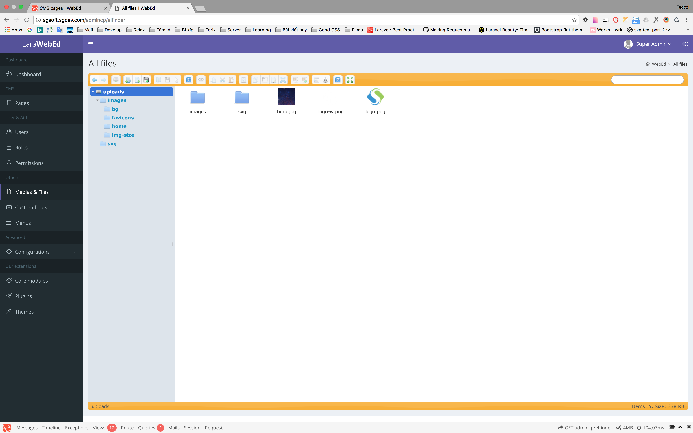
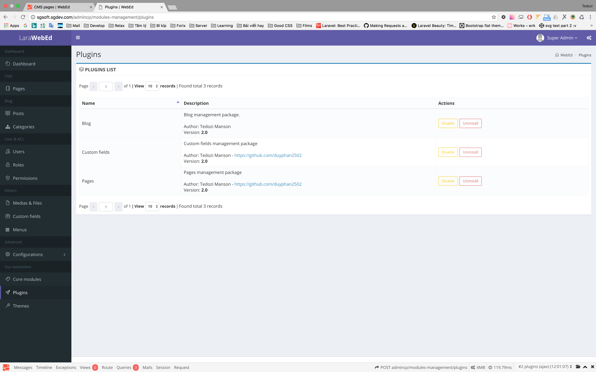
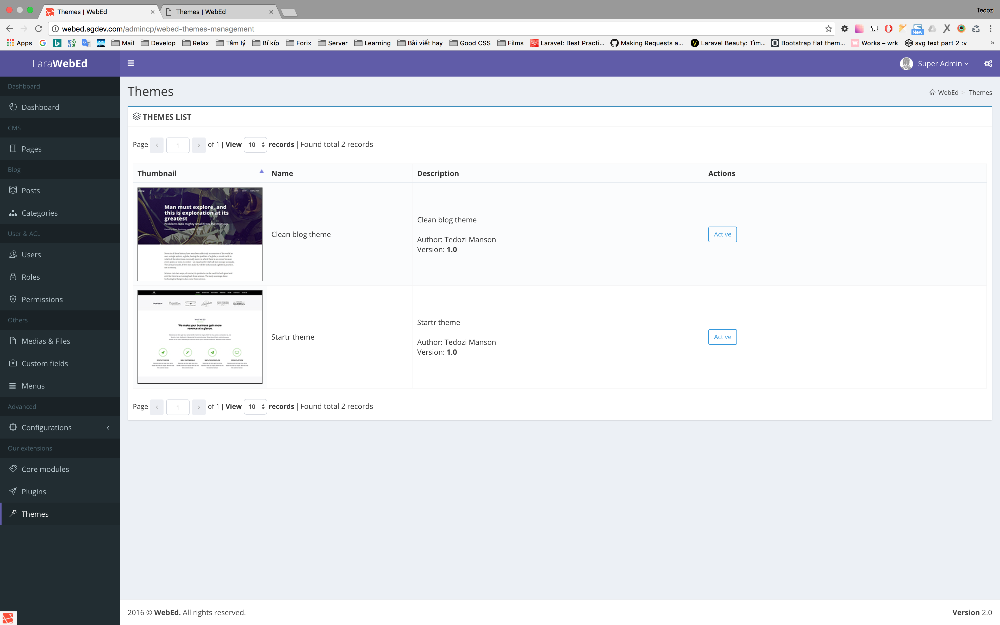

# Welcome to WebEd
####A CMS based on Laravel


A few months ago, I published a CMS called [LaraWebEd](https://github.com/duyphan2502/LaraWebEd).
Today, I would like to share you version 2 of that CMS. It's called **WebEd**.

####WebEd is always free!

###There are some features of this CMS:
- Modular packages.
- Manage files with Elfinder.
- ACL
- Menu management with drag & drop
- **Database caching** (repository pattern)
- Themes & plugins management.
- Hook

##System Requirement
On this projects, I use the latest Laravel version (currently 5.3). 
Please go to [laravel documentation page](https://laravel.com/docs/5.3/installation) to check your system requirements.

##WebEd installation guide

####Method 1: Install directly
```
composer create-project --prefer-dist sgsoft-studio/webed webed
```

####Method 2: Add WebEd to your Laravel project
```
composer require sgsoft-studio/base
```
Register the WebEd provider to **config/app.php**
```
WebEd\Base\Core\Providers\ModuleProvider::class,
```
Modify auth entity: open **config/auth.php**
```
'providers' => [
    'users' => [
        'driver' => 'eloquent',
        'model' => \WebEd\Base\Users\Models\EloquentUser::class,
    ],
],
```

###Then
```
php artisan cms:install
```

Access to dashboard:
> your-domain/admincp

You can config admin route by modify the .env:
```
WEBED_ADMIN_ROUTE=admincp
```

All available WebEd env config:
```
#Use for backup data
DB_DUMP_PATH=/Applications/AMPPS/mysql/bin/

#Caching service
CACHE_DRIVER=file
CACHE_REPOSITORY=true

#Admin route alias
WEBED_ADMIN_ROUTE=admincp

#Recaptcha
WEBED_RECAPTCHA_SITE_KEY=
WEBED_RECAPTCHA_SECRET_KEY=
```

If you see this message when enable plugins/themes, it's because of your server does not support composer dump-autoload
helper. Try to run **composer dump-autoload** by yourself.


>The base module of this class is enabled, but class not found: ***xxx***. Please review and add the namespace of this module to composer autoload section, then run **composer dump-autoload**


##Plugins
Download the plugins and places it at **/plugins** folder.

[Plugins list](https://github.com/webed-plugins/readme)

##Table of contents
- [WebEd module commands](./documentation/console/module.md)
- [WebEd theme commands](./documentation/console/theme.md)

###I love github!

##Some screenshots







