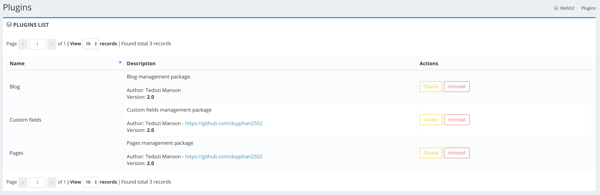

#WebEd module commands

####Install CMS
```
php artisan cms:install --refresh
```

**Note**: if you use **--refresh**, please make sure all plugins and themes are uninstalled!



####Get all modules information
```
php artisan cms:get:modules
php artisan cms:get:modules --type=base
php artisan cms:get:modules --type=plugins
```

####Export a base module
When you need to modify a base core module. It's time to use export method.
To know the alias of module, just run:
```
php artisan cms:get:modules --type=base
```
Then run
```
php artisan module:base:export {alias}
```

####Disable plugins
```
php artisan module:disable --all
```

####Enable plugins
```
php artisan module:enable --all
```

####Install plugin dependencies:
When you enable a plugin, it's still not have some related things like database schema, sample data...,
it's time that you need to run install.

There are two ways to install plugin:
```
php artisan module:install {alias}
```

or you go to **Admin Dashboard** page --> **Plugins**. Then just click to **Install** button.

####Uninstall plugin dependencies:
When you want to remove all installed dependencies of a plugin like database schema...,
it's time that you need to run uninstall.
```
php artisan module:uninstall {alias}
```

or you go to **Admin Dashboard** page --> **Plugins**. Then just click to **Uninstall** button.

##Generators

####Create a new plugin/module
```
php artisan module:create {alias}
```

####Other helpers:
```
php artisan module:make:controller {alias} {name} {--resource}

php artisan module:make:command {alias} {name}

php artisan module:make:facade {alias} {name}

php artisan module:make:middleware {alias} {name}

php artisan module:make:migration {alias} {name} {--create} {--table]

php artisan module:make:model {alias} {name} {table}

php artisan module:make:provider {alias} {name}

php artisan module:make:repository {alias} {name} {--no-cache}

php artisan module:make:request {alias} {name}

php artisan module:make:service {alias} {name}

php artisan module:make:support {alias} {name}

php artisan module:make:view {alias} {name} {--layout=1columns/2columns}
```

For example:

```
php artisan module:make:controller webed-blog SystemController
```

```
php artisan module:make:provider webed-blog HookServiceProvider
```